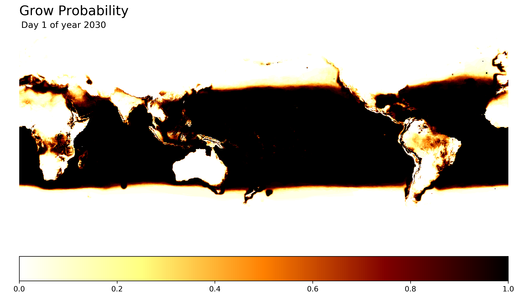

# Crop to the Future
Predicting crop growth with NASA climate projections ([NEX-GDDP](https://cds.nccs.nasa.gov/nex/)).

## Growing Degree-Day

Plant growth, from seed to maturity, can be forecasted by the amount of heat accumulated within sufficient temperature ranges. One popular measure of heat accumulation is called Growing Degree-Day ([GDD](https://en.wikipedia.org/wiki/Growing_degree-day)). The premise of a GDD is to capture whether a plant would grow on that day (i.e. average temperature is above a base temperature required for growth) and how much heat the plant would experience. The equation for a daily GDD is:  
  
I extend the GDD equation to incorporate a *top temperature*, above which plants cannot survive, to handle possible projections of extremely hot temperatures. 
  
The base temperature and top temperature values are known for many different plant species. 

An Accumulated GDD (AGDD) is the sum of consecutive non-zero GDDs, which represents the heat a plant would experience in a growing season. Studies have matched AGDD values to the stage of development for many plants. In wheat (Hard Red), for instance, leaf tips start emerging from the ground at about 145 AGDD and the plant fully matures at about 1665 AGDD ([source](http://msuextension.org/publications/AgandNaturalResources/MT200103AG.pdf).

AGDDs are forecasted with NASA's NEX-GDDP dataset and predictions are made of where a user-supplied plant could grow. The NEX-GDDP dataset contains 42 models (21 climate models under 2 greenhouse gas scenarions) that each project daily minumum and maximum temperatures for small grids of about 25km x 25km across the globe up until the year 2099 (about 12TB of data). For a given plant in a given year, I go through each NEX-GDDP model, calculate AGDD in each grid for every day, and check if the AGDD is above a threshold. If above the threshold, I consider it possible for the plant to grow from that day onwards. The probability of growth is the number of models where growth is possible out of all the models.

### Example: Wheat (Hard Red) 

Hard Red is a popular variety of wheat grown around the world. The wheat grows when temperatures are above 0&deg;C ([source](http://msuextension.org/publications/AgandNaturalResources/MT200103AG.pdf)) and below 34&deg;C ([source](http://iopscience.iop.org/article/10.1088/1748-9326/8/3/034016)). Within the temperature range, an AGDD of 1665 is required for the wheat to develop to maturity ([source](http://msuextension.org/publications/AgandNaturalResources/MT200103AG.pdf)).

[](examples/wheat/wheat_hard_red_2030.gif)

### Example: Corn

TODO

- AGDD = 1400
- Temp Base = 10
- Temp top = 35

### Example: Upland Rice Example

TODO
- AGDD = 2100
- Temp Base = 8.2
- Temp top = 43

### Location-Based Examples

It can be more beneficial to zoom in on specific grids and predict the long-term dynamics in the probability of growing a given crop. 

#### Example: Wheat in Grassland National Park, Saskatchewan

Hypothetically, if I wanted to grow Hard Red wheat in Grassland National Park (longitude=252.35&deg;E, latitude=49.125&deg;N), I'd be best to start planting according to:

FIX


## Notes

- There are other important factors in plant growth, like soil quality and water levels, but temperature is the most outside human control. 
- I don't include precipitation, so the assumption is that the crops will have proper irrigation. Future plans could look for like monsoons and crazy rain

## Setting up Ubuntu AWS Instance

The NEX datasets are in an AWS S3 bucket in the US West (Oregon) Region and processing (specifically transferring data) is fastest on Oregon instances.

### Mounting NEX-GDDP 
The NEX-GDDP data is available on AWS. To mount the data on an instance, run:
```
sudo apt-get update  
sudo apt-get upgrade  

sudo apt-get install automake autotools-dev g++ git libcurl4-gnutls-dev libfuse-dev libssl-dev libxml2-dev make pkg-config  

git clone https://github.com/s3fs-fuse/s3fs-fuse.git  
cd s3fs-fuse  
./autogen.sh  
./configure  
make  
sudo make install  

sudo sed -i -e 's/#user_allow_other/user_allow_other/g' /etc/fuse.conf 

mkdir /home/ubuntu/nex-gddp 
sudo s3fs -o allow_other,default_acl='public_read',public_bucket=1,uid=1000,gid=1000,umask=722 nasanex:/NEX-GDDP /home/ubuntu/nex-gddp/
```

### Julia
- run ```sudo apt-get install hdf5-tools```
- download and install [Julia](https://julialang.org/)
- add packages: JLD, NetCDF