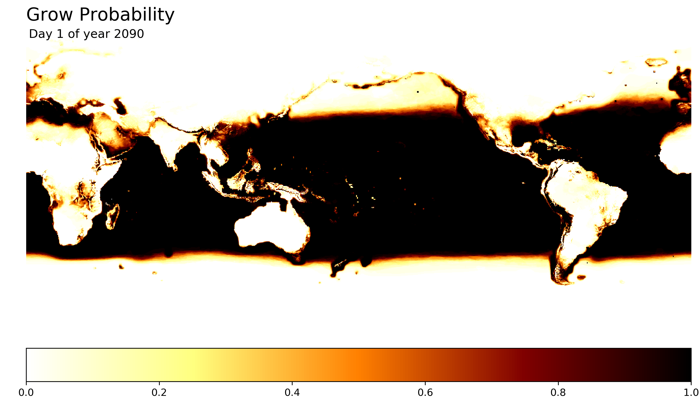

# Crop to the Future
Predicting crop growth with climate projections. Knowing where and when food can be grown is critical to everything. 

## Plant Biology

Plant growth, from seed to maturity, can be predicted by adding Growing Degree-Day ([GDD](https://en.wikipedia.org/wiki/Growing_degree-day)) values. GDD measures how much heat a plant would experience in a day of a growing season, simply calculated by:   
Where *Tmin* is the minimum daily temperature, *Tmax* is the maximum daily temperature, and *Tbase* is a base temperature above which the plant grows.
The GDD equation is extended to incorporate a critical *top temperature*, above which plants cannot survive, to handle possible projections of extremely hot temperatures.   
The base temperature and top temperature values are known for many different plant species. Accumulated GDD (AGDD) is the sum of consecutive non-zero GDDs and represents the amount of heat a plant would experience in a growing season. Studies have matched AGDD values to the stage of development for many plants. In wheat (Hard Red), for instance, leaf tips start emerging from the ground at about 145 AGDD and the plant fully matures at about 1665 AGDD ([source](http://msuextension.org/publications/AgandNaturalResources/MT200103AG.pdf)). **Crop to the Future** uses NASA's climate projections to calculate AGDDs and predict where user-supplied plants could grow.

## Global Climate Projections ([NEX-GDDP](https://cds.nccs.nasa.gov/nex/))

The NEX-GDDP dataset contains 42 models (21 climate models under 2 greenhouse gas scenarios) that each forecast daily minumum and maximum temperatures for small grids of about 25km x 25km across the globe up until the year 2099 (about 12TB of data). For a given plant in a given year, I go through each NEX-GDDP model, calculate AGDD in each grid for every day, and check if the AGDD is above a maturity threshold. If above the maturity threshold, I consider that the crop can be planted in that grid, on that day and reach maturity --- for the given model. The probability of growth is the number of models where growth is possible out of all the models.

## Notes

- There are other important factors in plant growth, like soil quality and water levels, but temperature is the most outside human control. 
- I don't include precipitation, so the assumption is that the crops will have proper irrigation. Future plans could look for like monsoons or adequate rainfall for growth.
- Predictions are made for land and sea. Maybe one day we grow crops on barges, but until then, it would be nice to remove sea grids.
- This is a lot of data crunching, I've only done a few examples, see below and in the examples folder.

## Examples

### Wheat (Hard Red)

Hard Red is a popular variety of wheat grown around the world. The wheat grows when temperatures are above [0&deg;C](http://msuextension.org/publications/AgandNaturalResources/MT200103AG.pdf) and below [34&deg;C](http://iopscience.iop.org/article/10.1088/1748-9326/8/3/034016). Within the temperature range, an AGDD of [1665](http://msuextension.org/publications/AgandNaturalResources/MT200103AG.pdf) is required for the wheat to develop to maturity.

#### 2090 - 2098



See examples/wheat_hard_read_2090.mp4 for video. Processing the following years.


### Corn

Corn has a base temperature of [10&deg;C](https://ndawn.ndsu.nodak.edu/help-corn-growing-degree-days.html), a maximum critical temperature of about [35&deg;C](https://www.sciencedirect.com/science/article/pii/S2212094715300116), and certain strains require an AGDD of [2700](https://graincrops.ca.uky.edu/files/corngrowthstages_2011.pdf) to reach maturity.

#### 2090 - 2098

*processing*

### Upland Rice

Upland rice doesn't need to grow in paddy fields; it has a base temperature of [8.2&deg;C](https://www.sciencedirect.com/science/article/pii/S0378377417303906), maximum critical temperature of about [35&deg;C](https://books.google.ca/books?id=wS-teh0I5d0C&lpg=PP2&ots=VCWFn0Zk5N&dq=yoshida%201978%20upland%20rice&lr&pg=PP1#v=onepage&q&f=false), and requires an AGDD of around [2100](https://www.sciencedirect.com/science/article/pii/S0378377417303906) to reach maturity. 

#### 2090 - 2098

*processing*

## Setting up NEX-GDDP Ubuntu AWS Instance

The NEX datasets are in an AWS S3 bucket in the US West (Oregon) Region and processing (specifically transferring data) is fastest on Oregon instances.

### Mounting NEX-GDDP 
The NEX-GDDP data is available on AWS. To mount the data on an instance, run:
```
sudo apt-get update  
sudo apt-get upgrade  

sudo apt-get install automake autotools-dev g++ git libcurl4-gnutls-dev libfuse-dev libssl-dev libxml2-dev make pkg-config  

git clone https://github.com/s3fs-fuse/s3fs-fuse.git  
cd s3fs-fuse  
./autogen.sh  
./configure  
make  
sudo make install  

sudo sed -i -e 's/#user_allow_other/user_allow_other/g' /etc/fuse.conf 

mkdir /home/ubuntu/nex-gddp 
sudo s3fs -o allow_other,default_acl='public_read',public_bucket=1,uid=1000,gid=1000,umask=722 nasanex:/NEX-GDDP /home/ubuntu/nex-gddp/
```

### Julia
- run ```sudo apt-get install hdf5-tools```
- download and install [Julia](https://julialang.org/)
- add packages: JLD, NetCDF

[1]: http://msuextension.org/publications/AgandNaturalResources/MT200103AG.pdf